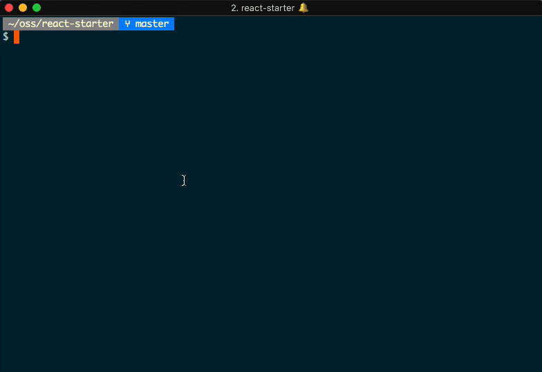

# Misfit



Misfit provides a command line-based UI for running npm scripts.

I started this project so that I wouldn't have to remember script names for different projects and could just select them from a list.

## Installation

````
npm install -g misfit
````

## Usage

````
cd some/project/root
misfit
````

You can also hit the "C" key to copy the highlighted command to your clipboard.

## Supported platforms

Misfit was developed on OS X.  If you'd like it to work on another OS, please submit a PR!

Misfit currently only searches the current working directory for a `package.json` file.

## Why "Misfit?"

Because [npm-ui](https://github.com/chbrown/npm-ui) and [npm-gui](https://github.com/q-nick/npm-gui) were already taken and I was listening to the Misfits when I started this project.  By the way, [Famous Monsters](https://en.wikipedia.org/wiki/Famous_Monsters) is a really good album.
